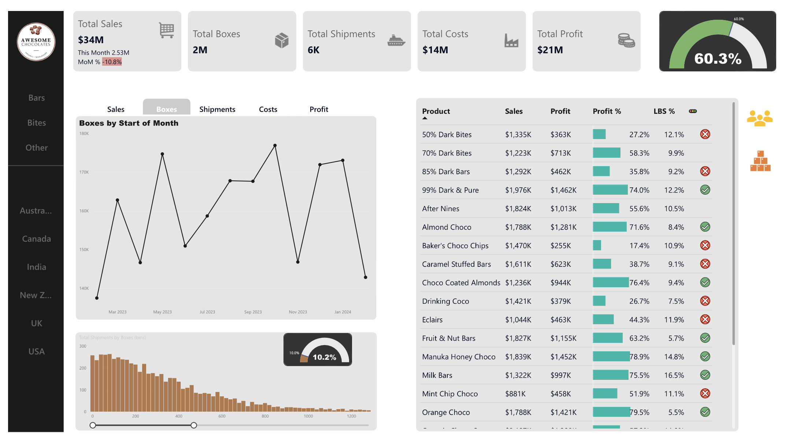

# Power-BI-Projects

Through a web-generated dataset from a fictitious enterprise called Awesome Chocolates in the confectionery industry, I used the DAX in Power BI to create measures and visualisations for this interactive Sales Analytics Dashboard that explores salesperson and product performance over time. 

